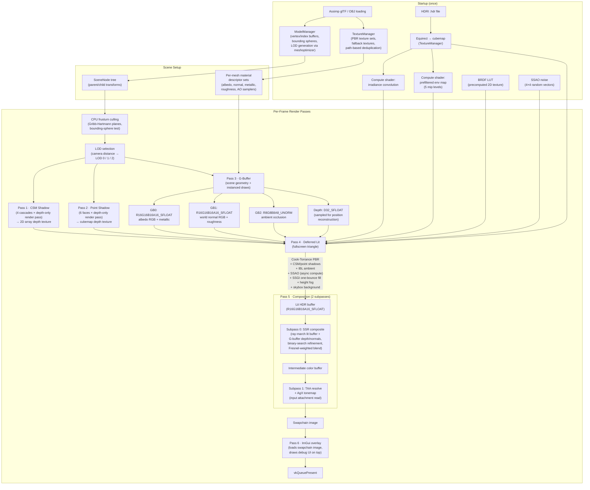

# Vulkan Renderer

A modular Vulkan renderer focused on the rendering architecture itself: deferred shading, PBR, image-based lighting, cascaded shadows, post-processing, runtime profiling, frustum culling, LODs, instancing, and VMA-backed resource management. Not a game engine — a renderer-first project with a demo scene large enough to make those decisions matter.

## What It Renders

The current demo loads a Sponza glTF scene as the environment and renders multiple DamagedHelmet instances as PBR test objects. The scene uses an HDR environment map for sky lighting and reflections, with a fly camera and an ImGui overlay for runtime tuning.

At a high level, one frame looks like this:



## Feature Set

- Vulkan renderer with separate device, swapchain, pipeline, descriptor, render pass, model, texture, and performance systems.
- Deferred rendering pipeline with a G-buffer for albedo/metallic, normal/roughness, AO, and depth.
- Cook-Torrance PBR lighting with metallic-roughness materials.
- glTF material support, including ORM-style roughness/metallic channel usage.
- Normal mapping through tangent-space TBN data generated by Assimp.
- Image-based lighting from an HDRI skybox:
  - irradiance cubemap for diffuse ambient,
  - prefiltered environment cubemap for specular IBL,
  - BRDF LUT for the split-sum approximation.
- GPU compute shaders for IBL precomputation.
- Cascaded shadow maps for directional light shadows.
- Omnidirectional point light shadows through a depth cubemap.
- Screen-space ambient occlusion, computed async on a dedicated compute queue.
- Screen-space one-bounce global illumination (SSGI) with temporal history.
- Screen-space reflections in a separate composite pass.
- Compute bloom pyramid (downsample/upsample) with histogram-based auto-exposure.
- Temporal anti-aliasing: jittered projection, YCoCg neighborhood clamp, Catmull-Rom history resampling.
- AgX tonemapping, plus optional post edge AA and CAS-style sharpening.
- Forward transparent pass for glTF `alphaMode=BLEND` materials, sorted back-to-front over the deferred result.
- GPU-driven rendering path: compute frustum + HZB occlusion culling feeding indirect draws.
- Bindless material textures via `VK_EXT_descriptor_indexing`.
- Data-driven scene files (`Resources/Scenes/*.scene`) with runtime scene switching and animated scene nodes.
- Exponential height fog.
- ImGui runtime overlay with:
  - FPS and frame-time graph,
  - per-pass GPU timing,
  - draw call and triangle counts,
  - VRAM budget reporting,
  - camera speed/FOV/draw distance controls,
  - light controls,
  - fog and LOD controls,
  - G-buffer debug views.
- Scene graph with parent/child transforms.
- Instanced rendering for repeated meshes.
- Dynamic LOD generation with meshoptimizer.
- CPU frustum culling using bounding spheres.
- Vulkan debug labels for RenderDoc-friendly captures.

## Architecture

The project used to be closer to a typical single-file Vulkan experiment. The current code is split into smaller systems so the renderer can grow without turning into a pile of global state.

| System | Responsibility |
| --- | --- |
| `VulkanDevice` | Instance creation, validation/debug utilities, physical/logical device selection, queues, allocator setup |
| `VulkanSwapchain` | Swapchain creation, resize handling, swapchain image views, composition framebuffers |
| `RenderPassManager` | G-buffer, lit, composition, shadow, and ImGui render passes |
| `VulkanPipeline` | Graphics pipeline creation, pipeline layouts, shader modules, pipeline cache |
| `DescriptorManager` | Uniform buffers, material texture sets, G-buffer descriptors, input attachments, IBL descriptors |
| `TextureManager` | Texture loading, fallback textures, HDR cubemap creation, compute IBL resources, texture deduplication |
| `ModelManager` / `Model` | Assimp loading, mesh buffers, material extraction, bounding spheres, generated LOD buffers |
| `SceneNode` | Transform hierarchy, model placement, per-node animation |
| `Scene` | Scene-file parsing (`Resources/Scenes/*.scene`), runtime scene switching |
| `RenderResources` | Per-swap-image render-target registry, tracked image layouts and transitions |
| Pass modules | `GpuDrivenGBufferPass`, `ShadowPass`, `BloomPass`, `AutoExposurePass`, `SsaoPass`, `SsgiPass`, `CompositePass`, `ImGuiLayer` — each owns its resources, pipelines, and command recording |
| `InputManager` | GLFW input state, mouse delta tracking, resize events |
| `PerformanceMetrics` | CPU frame time, Vulkan timestamp queries, draw/triangle counts, VRAM budget |

`VulkanRenderer` is still the orchestrator, but the low-level jobs have been pulled into focused classes. It owns the frame flow, creates the major GPU resources, records command buffers, and coordinates the render passes.

## Render Pipeline

The renderer is built around a deferred pipeline:

1. Shadow passes

   Directional lighting uses four cascaded shadow maps. The cascade split scheme blends logarithmic and uniform splits, and the renderer snaps cascade projections to texels to reduce shimmering. Point light shadowing renders six faces into a cubemap depth image.

2. G-buffer pass

   Scene geometry writes material and geometric data:

   - `GB0`: `R16G16B16A16_SFLOAT` - albedo RGB + metallic
   - `GB1`: `R16G16B16A16_SFLOAT` - world normal RGB + roughness
   - `GB2`: `R8G8B8A8_UNORM` - ambient occlusion
   - depth: sampled later for position reconstruction

3. SSAO and SSGI passes

   SSAO runs as a compute dispatch on the dedicated compute queue, overlapping the graphics work. SSGI gathers a one-bounce diffuse fill at half resolution with a temporal history ring.

4. Lit pass

   A fullscreen triangle reads the G-buffer and runs the main lighting shader. This pass handles PBR direct lighting, CSM shadows, point shadows, IBL, the SSAO/SSGI results, skybox background, and height fog. The result is written to an HDR lit buffer, then the forward transparent pass blends `alphaMode=BLEND` geometry on top.

5. Bloom and auto-exposure

   A compute bloom pyramid (box-filtered downsample, tent upsample) and a luminance-histogram auto-exposure pass run on the lit buffer.

6. Composition pass

   Screen-space reflections sample the lit buffer and G-buffer depth/normal data. The second subpass then resolves TAA against the history buffer and applies AgX tonemapping (plus optional edge AA / sharpening) into the swapchain image.

7. ImGui pass

   The UI is drawn over the final image using a separate render pass that loads the swapchain image instead of clearing it.

## Optimization Notes

This project is not only about getting pixels on screen. A lot of the work is about making the renderer behave like a renderer that expects scale.

- VMA-backed resources: buffers and images go through Vulkan Memory Allocator instead of raw `vkAllocateMemory` calls.
- RAII wrappers: `AllocatedBuffer`, `AllocatedImage`, and `ImageViewHandle` own Vulkan resources and clean them up through move-safe wrappers.
- Pipeline cache: `pipeline_cache.bin` is loaded and saved so pipeline creation can reuse driver cache data between runs.
- Texture and material deduplication: loaded textures are cached by path/key, and missing maps use generated fallback textures.
- GPU-side IBL precomputation: irradiance and prefilter maps are generated with compute shaders instead of slow startup CPU loops.
- Frustum culling: models and submeshes are skipped before draw submission when their bounding sphere is outside the camera frustum.
- Dynamic LODs: each mesh gets simplified index buffers at load time using meshoptimizer, and LOD is selected by camera distance.
- Instancing: repeated helmet meshes use an instance buffer and `VK_VERTEX_INPUT_RATE_INSTANCE`.
- Reduced descriptor churn: the G-buffer path binds the scene descriptor once and only rebinds material descriptors when the material changes.
- Shadow LODs: far cascades and point-shadow passes use lower LODs where silhouette detail is less noticeable.
- Timestamp profiling: GPU timestamps measure shadow, point shadow, G-buffer, and deferred/composition costs separately.
- RenderDoc labels: debug labels mark major passes and cascade/face work so captures are easier to read.

## Benchmark Snapshot

The renderer logs per-pass GPU timings live and prints a benchmark report on shutdown. This snapshot is the current Sponza scene at 1920x1080 on an RTX 3050 mobile (4 GiB), **Release build**, steady state over 2,500+ frames.

| Metric | Value |
| --- | ---: |
| Average frame time | 11.4 ms |
| Average FPS | ~88 |
| Draw calls per frame | 38 (GPU-culled, indirect) |
| Triangles per frame | ~1.13 M |
| Steady-state VRAM | ~1.2 GiB |

GPU pass timing (same run):

| Pass | Time |
| --- | ---: |
| Cascaded shadow maps | 0.52 ms |
| Point shadow cubemap | 1.19 ms |
| G-buffer (GPU-driven) | 1.5 ms |
| SSGI | 3.1 ms |
| Deferred lit | 3.0 ms |
| Bloom pyramid | 0.70 ms |
| Auto-exposure | 0.13 ms |
| SSR / TAA / tonemap composite | 0.54 ms |
| ImGui | 0.06 ms |

Two things worth noting. The frame is dominated by the screen-space lighting passes (SSGI + deferred lit) rather than geometry submission — culling and LOD selection run on the GPU, so the G-buffer pass stays cheap even with the scene fully in view. And a Debug build with validation layers runs within ~8% of Release: the renderer is thoroughly GPU-bound, so CPU-side build flags barely move the frame time.

## Controls

| Input | Action |
| --- | --- |
| `W`, `A`, `S`, `D` | Move the camera |
| Mouse | Look around in camera mode |
| `Tab` | Toggle between camera mode and UI mode |
| `F1` | Toggle HUD-free screenshot mode (hides all panels) |
| `Esc` | Close the application |

In UI mode, the ImGui panels expose camera settings, lighting, fog, LOD distances, point shadow range, G-buffer debug views, and live performance metrics.

## Requirements

- C++17 compiler
- CMake 3.16 or newer
- Vulkan SDK / Vulkan loader and headers
- GLFW
- GLM
- Assimp
- spdlog
- glslangValidator, only needed if you want to recompile shaders

On Ubuntu/Debian-style systems, the dependency set is roughly:

```bash
sudo apt install cmake g++ libvulkan-dev vulkan-tools glslang-tools \
  libglfw3-dev libglm-dev libassimp-dev libspdlog-dev
```

CMake also fetches:

- `meshoptimizer` for runtime LOD generation
- Dear ImGui docking branch for the overlay

That means the first CMake configure needs network access unless those dependencies are already available through CMake's FetchContent cache.

## Building

Clone the repository and configure a release build:

```bash
cmake -S . -B build -DCMAKE_BUILD_TYPE=Release
cmake --build build -j
```

Run it from the repository root so relative resource paths resolve correctly:

```bash
./build/VulkanRenderer
```

The project currently assumes an X11 GLFW platform in `src/main.cpp`, so Linux/X11 is the path of least resistance right now. Other platforms should be possible, but they are not the focus of the current setup.

## Recompiling Shaders

Precompiled SPIR-V shader files are committed in `Shaders/`. If you edit GLSL, rebuild them with:

```bash
chmod +x Shaders/compile_shaders.sh
./Shaders/compile_shaders.sh
```

The script compiles `.vert`, `.frag`, and `.comp` files with `glslangValidator`.

## Repository Layout

```text
include/                 Public headers for renderer systems
src/                     C++ implementation
Shaders/                 GLSL shaders and compiled SPIR-V
Resources/Models/        Demo glTF assets
Resources/Scenes/        Data-driven scene files (runtime-switchable)
Resources/HDRIs/         HDR environment maps
Resources/LUTs/          BRDF LUT
Resources/Textures/      PBR texture sets
third_party/             Vendored third-party code kept with the repo
TODO.md                  Local development roadmap, ignored by git
IMPLEMENTATION_NOTES.md  Local technical notes, ignored by git
```

## Current Status

This is an active renderer project, not a packaged engine. The current focus is graphics architecture and rendering features rather than editor tooling or game-level systems.

Working well:

- Modular Vulkan renderer structure with per-pass modules
- Deferred PBR scene rendering with a forward transparent pass
- glTF model and material loading; scene files with runtime switching and animated nodes
- IBL, CSM + point shadows, SSAO, SSGI, SSR, fog, bloom pyramid, auto-exposure
- TAA + AgX tonemapping, post edge AA, sharpening
- Bindless material textures, GPU-driven culling (frustum + HZB occlusion) with indirect draws
- Async compute SSAO on a dedicated queue
- ImGui debugging and profiling overlay
- LODs, instancing, pipeline cache, VMA resource management

Still on the roadmap:

- Screenshot/video capture for portfolio output
- Hot shader reload
- Skeletal animation
- Multi-threaded command buffer recording (opt-in path exists for the CPU G-buffer)
- Volumetric lighting, GPU particles
- Optional hardware ray-traced shadows/reflections or VXGI

## Assets And Credits

This repository includes third-party assets and libraries for testing the renderer:

- Khronos glTF sample-style assets such as Sponza, DamagedHelmet, and FlightHelmet. See the license files inside `Resources/Models/`.
- HDRI and PBR texture resources under `Resources/`. Check the included source/license metadata where present.
- Dear ImGui, meshoptimizer, stb, Vulkan Memory Allocator, GLFW, GLM, Assimp, and spdlog are used by the renderer or build.

The assets are here to make the renderer exercise real material, lighting, and scale problems. The renderer code is the main project.

## Why This Project Matters To Me

This started from a stubborn feeling: I was interested in game development, but using a full engine made the system feel too far away. Everything was convenient, but also hidden. The first plan was a small monolithic engine in OpenGL, but then I got curious about Vulkan, and it became obvious very quickly that "just the renderer" was already a serious project.

The point of this repository is not just "I can use Vulkan." It is proof that I wanted to understand the uncomfortable parts: why a frame needs multiple passes, why descriptor layouts shape an engine, why memory ownership matters, why a shadow map shimmers, why PBR needs precomputed environment data, why a profiler is part of the renderer and not an afterthought.

Building this has made graphics feel less like a black box. That was the original goal: to get closer to the system, one painfully explicit Vulkan object at a time.
